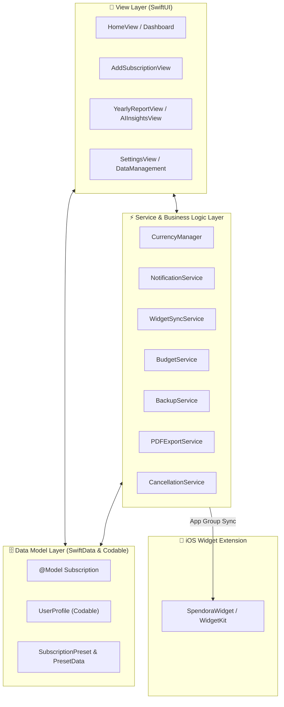

# 💎 Spendora — Smart Subscription & Expense Tracker
### Mobile Application Development Capstone Project 2026

<p align="center">
  
  
  
  
  
  
  
</p>

<p align="center">
  <b>A privacy-first native iOS application for tracking, analyzing, and optimizing recurring subscriptions and recurring spending.</b>
</p>

---

## 📌 Project Overview

Managing recurring subscriptions across multiple platforms, streaming services, and SaaS tools can quickly lead to unwanted renewals and hidden costs. 

**Spendora** was created as a final **Mobile Application Development Capstone Project** to solve this problem. Built entirely using Apple native frameworks — **SwiftUI**, **SwiftData**, **Swift Charts**, and **WidgetKit** — Spendora operates 100% offline and on-device, ensuring complete data privacy without requiring external server connections or bank logins.

---

## 🎥 Video Demonstration & Animated Preview

<p align="center">
  
</p>

<p align="center">
  <a href="https://raw.githubusercontent.com/snaimio/Spendora/main/demo/Spendora_Demo.mp4" target="_blank">
    
  </a>
  <a href="https://github.com/snaimio/Spendora/raw/main/demo/Spendora_Demo.mp4">
    
  </a>
</p>

> 🎬 **Full Walkthrough Video**: Features synchronized human voiceover narration covering the Dashboard & Budget, 1-Tap Record Payment & Instant Undo, Add Subscription with Presets, Subscriptions Management, AI Insights & Value Scoring, Yearly Financial Summary, Home Screen Widgets, and JSON Data Backup.
> 
> 📁 **Direct Stream URL**: [Play Full Walkthrough Video](https://raw.githubusercontent.com/snaimio/Spendora/main/demo/Spendora_Demo.mp4)  
> 🎞️ **Interactive Flow Preview**: [`screenshots/demo_preview.gif`](screenshots/demo_preview.gif)

---

## 📱 App Screenshots & Feature Showcase

### 1. 🚀 Onboarding Experience

| Welcome Slide 1 | Welcome Slide 2 |
|:---:|:---:|
|  |  |
| *Track all subscriptions in one central hub* | *Get advance renewal reminders & notifications* |

| Welcome Slide 3 | Welcome Slide 4 |
|:---:|:---:|
|  |  |
| *Discover savings with AI-powered insights* | *Visualize spending on an intuitive calendar* |

<br>

### 2. 📊 Dashboard & Subscription Management

| Dashboard & Monthly Metrics | Active Subscriptions List |
|:---:|:---:|
|  |  |
| *Real-time spend metrics, budget gauge & countdown cards* | *Categorized list with SF Symbols & multi-criteria sorting* |

| Service Detail View | Subscription Editor |
|:---:|:---:|
|  |  |
| *One-tap cancellation & direct provider web link* | *Customize cost, cycle, category & color accent chips* |

<br>

### 3. ➕ Smart Add & Renewal Calendar

| Fast Preset Creator | Interactive Renewal Calendar |
|:---:|:---:|
|  |  |
| *Pre-populated catalog for 15+ top services* | *Visual monthly calendar marking upcoming charge dates* |

<br>

### 4. 📈 Swift Charts Analytics & Reports

| Yearly Overview & Trends | Monthly Spend Breakdown |
|:---:|:---:|
|  |  |
| *Interactive Swift Charts graphs & PDF report generator* | *Category percentage breakdown & spend velocity* |

<br>

### 5. 🤖 AI Insights, Savings Score & Gamified Challenges

| AI Financial Insights | Savings Score |
|:---:|:---:|
|  |  |
| *Satisfaction-driven engine detecting underused subscriptions* | *Gamified financial health score card* |

| Financial Challenges | User Profile & Security |
|:---:|:---:|
|  |  |
| *Gamified savings goals & milestone badges* | *Local user identity & on-device security options* |

<br>

### 6. ⚙️ Customization, Dark Mode & iOS Widgets

| Multi-Currency Engine | Dark Mode Theme |
|:---:|:---:|
|  |  |
| *Instant formatting across 10+ global currencies* | *Sleek dark theme UI optimized for OLED screens* |

| Preferences & Backup | iOS Home & Lock Screen Widgets |
|:---:|:---:|
|  |  |
| *JSON backup/restore & CSV data exporter* | *Midnight Sage Teal widgets with official Spendora logo* |

---

## 🏗️ System Architecture & Data Flow



---

## 📊 Core Data Models & Schemas

Spendora uses type-safe Swift structures combining **SwiftData** `@Model` persistence and `Codable` profile preferences.

### 1. `Subscription` (`@Model` Entity)
The primary persistence schema managed via SwiftData:

```swift
@Model
final class Subscription {
    var id: UUID                         // Unique record identifier
    var name: String                     // Service name (Netflix, Spotify, etc.)
    var cost: Double                     // Billing cost per cycle
    var category: String                 // Category (Entertainment, Productivity, Utilities, etc.)
    var isYearly: Bool                   // Billing cycle flag (true = Yearly, false = Monthly)
    var nextBillingDate: Date            // Next scheduled charge date
    var previousBillingDate: Date?       // Previous billing date for instant payment undo
    var lastPaymentDate: Date?           // Timestamp when payment was last recorded
    var notes: String?                   // User notes & reminders
    var colorHex: String?                // Accent theme color hex string
    var isTrial: Bool                    // Flag indicating free trial status
    var trialEndDate: Date?              // Expiration date for free trial
    var usageRating: Int                 // Value satisfaction rating (1 to 5 stars)
    var paymentMethod: String            // Payment method (Credit, Apple Pay, PayPal, etc.)
    var iconName: String?                // SF Symbol icon identifier
    var isCancelled: Bool                // Active vs. Cancelled status
    var cancellationUrl: String?         // Direct provider web link for cancellation
}
```

### 2. `UserProfile` (`Codable` Model)
Manages user preferences stored locally via `UserDefaults`:

```swift
struct UserProfile: Codable {
    var id: UUID                         // Local profile identifier
    var name: String                     // User display name
    var email: String                    // Account email address
    var defaultCurrency: String          // Preferred currency symbol & code (USD, CAD, EUR, etc.)
    var monthlyBudget: Double            // User-configured monthly budget limit
    var notificationsEnabled: Bool       // Global notification toggle
    var reminderTime: Date               // Preferred morning reminder delivery time
}
```

---

## ⚡ Core Services & Managers

| Service | Responsibility |
|---|---|
| `CurrencyManager` | Formats global currencies and resolves symbols across 10+ currencies (USD, CAD, EUR, GBP, JPY, AUD, CHF, INR, etc.). |
| `NotificationService` | Schedules advance local reminders for upcoming renewal dates via `UNUserNotificationCenter`. |
| `WidgetSyncService` | Real-time synchronization of active subscriptions and spending to WidgetKit via App Groups (`group.com.trios2026sn.Spendora`). |
| `BudgetService` | Calculates budget compliance, spend progress, and alerts against user-defined spending caps. |
| `BackupService` | Generates secure JSON data exports and handles local document picker restoration. |
| `PDFExportService` | Generates vector-rendered PDF reports summarizing yearly and monthly spend breakdowns. |
| `ExportService` | Generates standard CSV spreadsheets for external financial analysis. |
| `CancellationService` | Resolves official web cancellation links and guidance for popular subscription providers. |

---

## 📂 Project Directory Structure

```
Spendora/
├── demo/                                     # Capstone Presentation Video & Media
│   ├── Spendora_Demo.mp4                     # Full Walkthrough Video with Voice Narration
│   └── thumbnail.png                         # Video presentation cover thumbnail
│
├── screenshots/                              # Live iOS Screen Previews
│   ├── demo_preview.gif                      # Animated interactive flow preview
│   ├── dashboard.png                         # Dashboard & Monthly Spend Hero
│   ├── dashboard_1.png                       # Next Charge Card with 1-Tap Payment
│   ├── subscriptions.png                     # Subscriptions list & sorting
│   ├── service_details.png                   # Provider details & cancellation link
│   ├── edit_subscriptions.png                # Subscription editor
│   ├── add_subscription.png                  # Preset catalog with color chips
│   ├── calendar.png                          # Interactive renewal calendar
│   ├── yearly_report.png                     # Swift Charts analytics & PDF export
│   ├── ai_insights_1.png                     # Rule-based AI financial insights
│   ├── savings_score.png                     # Financial health score card
│   ├── challenges.png                        # Gamified savings achievements
│   ├── settings.png                          # Settings, Currency & JSON Backup
│   └── widget.png                            # Midnight Sage Teal widgets
│
├── Spendora/
│   ├── App/
│   │   └── SpendoraApp.swift                 # App entry point initializing SwiftData ModelContainer
│   │
│   ├── Models/                               # SwiftData @Model & Data Structures
│   │   ├── Subscription.swift                # Main SwiftData schema & properties
│   │   ├── Subscription+Formatting.swift     # Formatting & 1-tap payment undo helpers
│   │   ├── UserProfile.swift                 # User identity & preference settings
│   │   └── SubscriptionPreset.swift          # Preset catalog models
│   │
│   ├── Services/                             # Core Business Logic & Managers
│   │   ├── CurrencyManager.swift             # Currency conversion & formatting
│   │   ├── NotificationService.swift         # Local advance notification scheduler
│   │   ├── WidgetSyncService.swift           # WidgetKit App Group sync manager
│   │   ├── BudgetService.swift               # Monthly spending budget calculator
│   │   ├── BackupService.swift               # JSON export & restore engine
│   │   ├── PDFExportService.swift            # Native vector PDF builder
│   │   └── ExportService.swift               # CSV spreadsheet generator
│   │
│   ├── Styles/                               # Apple Native HIG Design Tokens
│   │   └── SpendoraTheme.swift               # Sage Teal #2AB7A9 theme & Apple system surfaces
│   │
│   ├── Views/                                # SwiftUI Feature Screens
│   │   ├── Home/                             # Dashboard, Next Charge card, 1-Tap Record Payment
│   │   ├── Subscriptions/                    # List view, Search, Detail cards, Swipe actions
│   │   ├── Add/                              # Add Subscription form & preset picker
│   │   ├── Reports/                          # Swift Charts analytics, PDF export, AI Insights
│   │   ├── Calendar/                         # Renewal calendar
│   │   ├── Onboarding/                       # First-launch onboarding
│   │   └── Settings/                         # App options, JSON Backup, About Capstone
│   │
│   └── Assets.xcassets                       # App logo, icons, accent colors
│
├── SpendoraWidget/                           # iOS 17 Home Screen Widget Extension
│   ├── SpendoraWidget.swift                  # Small, Medium, Large & Lock Screen widgets
│   └── SpendoraWidgetBundle.swift            # Widget bundle entry point
│
└── SpendoraTests/                            # Unit Test Suite
    ├── BudgetServiceTests.swift
    ├── CurrencyManagerTests.swift
    └── SubscriptionTests.swift
```

---

## 📋 Capstone Submission Checklist

| Deliverable | Status | Details |
|---|:---:|---|
| **App Source Code** | ✅ Complete | 100% native Swift & SwiftUI project targeting iOS 17+. |
| **Clean Architecture** | ✅ Complete | MVVM design pattern with SwiftData local persistence. |
| **Documentation** | ✅ Complete | Full code docstring coverage (`///`, `// MARK:`). |
| **App Screenshots** | 📱 Complete | Live screenshots embedded in `screenshots/`. |
| **Walkthrough Video** | 🎬 Complete | Full demonstration with voice narration in [`demo/Spendora_Demo.mp4`](https://raw.githubusercontent.com/snaimio/Spendora/main/demo/Spendora_Demo.mp4). |

---

## 🚀 Getting Started

### Prerequisites

| Requirement | Minimum Version |
|---|---|
| **Xcode** | 15.0+ (Xcode 16 recommended) |
| **iOS Target** | iOS 17.0 or later |
| **Swift Compiler** | Swift 5.9+ / Swift 6 |

### Build Instructions

1. **Clone the Repository**:
   ```bash
   git clone https://github.com/snaimio/Spendora.git
   cd Spendora
   ```

2. **Open in Xcode**:
   ```bash
   open Spendora/Spendora.xcodeproj
   ```

3. **Compile & Run**:
   * Select the `Spendora` scheme in Xcode.
   * Choose an iOS 17+ Simulator or connected iPhone device.
   * Press **`Cmd + R`** to build and run the application.

---

## 👨‍💻 Author & Academic Information

* **Developer**: Sheikh Naim
* **Course**: Mobile Application Development Capstone 2026
* **Repository**: [github.com/snaimio/Spendora](https://github.com/snaimio/Spendora)

---

## 📄 License

Distributed under the **MIT License**. See [LICENSE](LICENSE) for full details.
