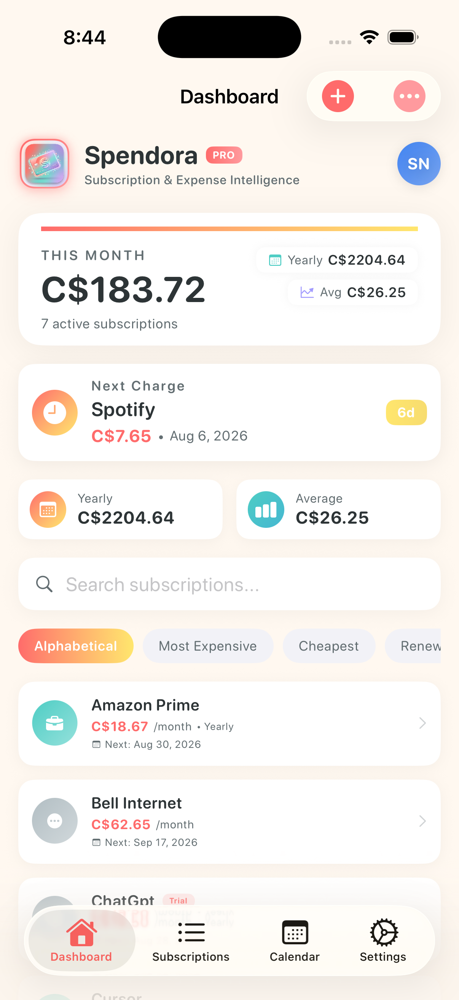
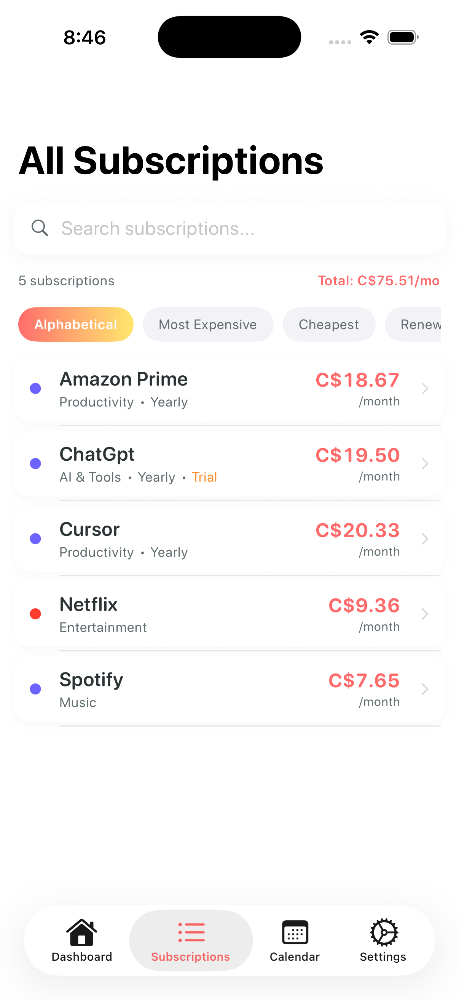
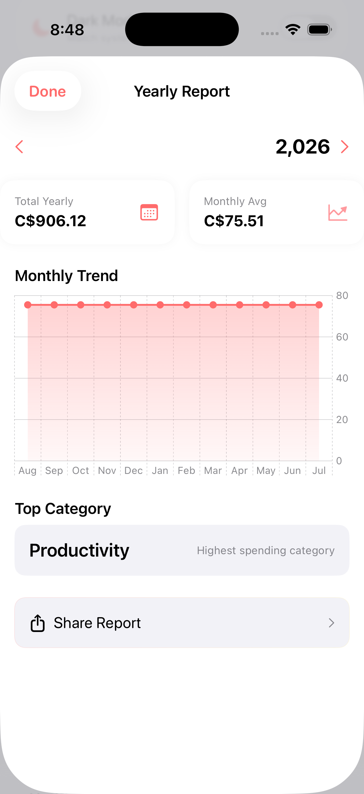
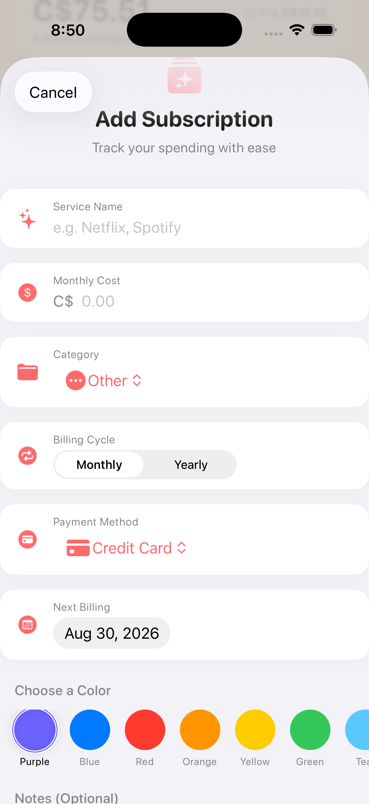
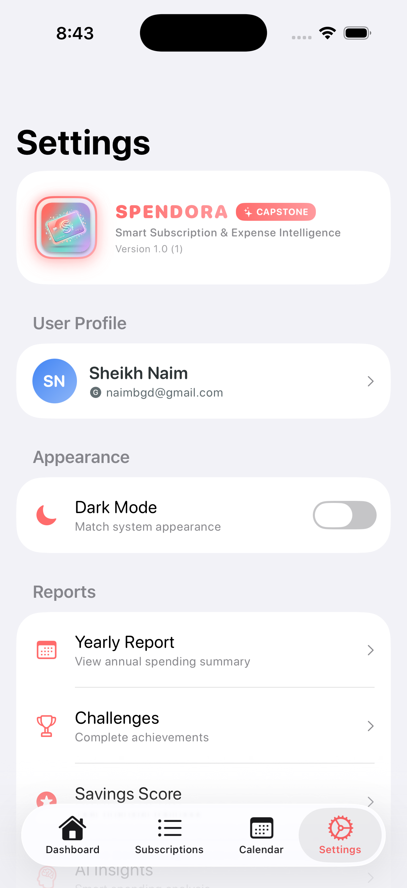
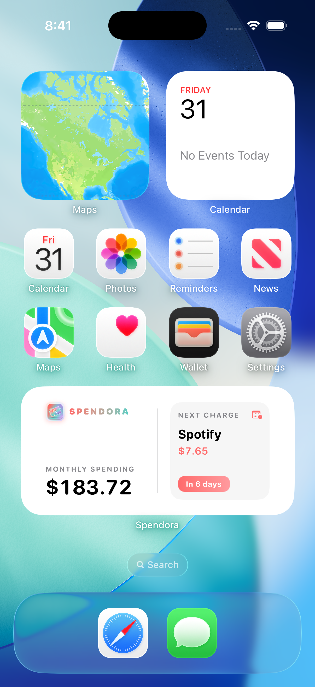
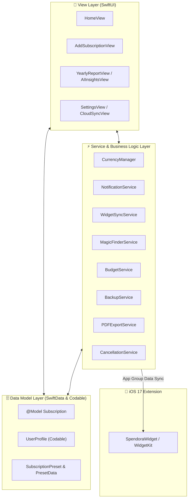

# 💎 Spendora - Smart Subscription & Financial Analytics Engine

<p align="center">
  
  
  
  
  
  
  
</p>

<p align="center">
  <b>A privacy-first, premium native iOS application for tracking, analyzing, and optimizing recurring subscriptions & spending.</b>
</p>

---

## 📌 Overview

Subscription fatigue is one of the fastest-growing personal financial challenges today. Users frequently sign up for streaming platforms, SaaS tools, cloud storage, and fitness memberships, quickly losing track of recurring billing dates—resulting in hidden charges and unwanted renewals.

**Spendora** solves this problem with an elegant, privacy-first native iOS application built using **SwiftUI**, **SwiftData**, **Swift Charts**, and **WidgetKit**. All processing and persistence happen 100% offline on-device without needing credentials or bank access.

---

## 🎥 Demo Video Showcase

[](https://www.youtube.com/@TheResilientPulse)

> 🎬 **Generated Video Showcase**: High-definition presentation video [**`screenshots/demo_video.mp4`**](screenshots/demo_video.mp4) rendering feature highlights, dashboard metrics, receipt parsing via MagicFinder, Swift Charts analytics, and iOS 17 home screen widgets.
> 
> 📺 Watch more walkthroughs on YouTube channel [**@TheResilientPulse**](https://www.youtube.com/@TheResilientPulse).

---

## 📱 App Screenshots

<p align="center">
  
  
  
</p>

<p align="center">
  
  
  
</p>

---

## 🏗️ System Architecture & Data Flow



---

## 📊 Core Data Structures & Models

Spendora features a robust, type-safe data model architecture combining **SwiftData** `@Model` persistence, `Codable` profile settings, and reactive services.

### 1. `Subscription` (`@Model` Entity)
The primary persistence schema managed via SwiftData.

```swift
@Model
final class Subscription {
    var id: UUID                         // Unique record identifier
    var name: String                     // Service name (e.g. Netflix, Spotify, iCloud)
    var cost: Double                     // Billing cost per cycle
    var category: String                 // Category (Entertainment, Productivity, Utilities, etc.)
    var isYearly: Bool                   // Billing cycle flag (true = Yearly, false = Monthly)
    var nextBillingDate: Date            // Next scheduled charge date
    var notes: String?                   // Optional user notes & reminders
    var colorHex: String?                // Accent theme color hex string for UI cards
    var isTrial: Bool                    // Flag indicating free trial status
    var trialEndDate: Date?              // Expiration date for free trial
    var trialConvertedToPaid: Bool       // Status flag for trial-to-paid conversion
    var expectedPrice: Double?           // Baseline price for price hike detection
    var priceAlertEnabled: Bool          // Flag to trigger notifications on price increase
    var usageRating: Int                 // Value utility rating (1 to 5 stars)
    var paymentMethod: String            // Payment method (Credit, Apple Pay, PayPal, etc.)
    var iconName: String?                // SF Symbol icon override
    var isFlagged: Bool                  // Flagged status for unused / high-cost subscriptions
    var cancellationUrl: String?         // Direct provider web link for one-tap cancellation
}
```

### 2. `UserProfile` (`Codable` Model)
Manages user preferences, identity state, and local security configurations stored in `UserDefaults`.

```swift
struct UserProfile: Codable {
    var id: UUID                         // Local profile identifier
    var name: String                     // User's preferred display name
    var email: String                    // Account email address
    var authProvider: AuthProvider       // Auth status (Guest, Apple, Google, Email)
    var defaultCurrency: String          // Preferred currency symbol & code (USD, CAD, EUR, etc.)
    var monthlyBudget: Double            // User-configured monthly expenditure cap
    var notificationsEnabled: Bool       // Global local notification toggle
    var biometricEnabled: Bool           // Face ID / Touch ID lock state
}
```

### 3. `SubscriptionPreset` & `PresetData`
Pre-populated catalog containing standard presets for fast one-tap subscription creation (e.g. Netflix, Spotify, Disney+, iCloud, ChatGPT Plus, YouTube Premium).

```swift
struct SubscriptionPreset: Identifiable {
    let id: UUID
    let name: String
    let defaultCost: Double
    let category: String
    let defaultIsYearly: Bool
    let colorHex: String
    let iconName: String
    let cancellationUrl: String
}
```

### 4. Core Supporting Enums & Value Types

| Type | Kind | Purpose |
|---|---|---|
| `PaymentMethod` | `enum String` | Standardized payment options (`creditCard`, `applePay`, `paypal`, `bankTransfer`, `debitCard`). |
| `SortOption` | `enum String` | Dynamic sorting modes (`nextBilling`, `costDescending`, `costAscending`, `nameAscending`, `rating`). |
| `OnboardingPage` | `struct` | Data layout for welcome page slides, features, and accent colors. |

---

## ⚡ Services & Business Logic Engine

| Service | Responsibility |
|---|---|
| `CurrencyManager` | Handles global currency formatting, symbol resolution, and exchange conversions across 10+ currencies (USD, CAD, EUR, GBP, JPY, AUD, CHF, INR, BRL, CNY). |
| `NotificationService` | Schedules 3-day advance local notifications for upcoming billing renewal dates via `UNUserNotificationCenter`. |
| `MagicFinderService` | Smart auto-detection engine parsing pasted receipts, confirmation text, or emails to pre-fill subscription details. |
| `WidgetSyncService` | Real-time synchronization of active subscription stats to WidgetKit via App Groups (`group.com.trios2026sn.Spendora`). |
| `BudgetService` | Calculates budget compliance, spend velocity, and alert thresholds against user-defined spending caps. |
| `BackupService` | Generates secure JSON data exports and handles local restoration of user data. |
| `PDFExportService` | Generates vector-rendered PDF reports summarizing yearly/monthly spend breakdowns. |
| `CancellationService` | Resolves official web cancellation links and steps for common subscription providers. |

---

## ✨ Feature Matrix

| Category | Feature | Description | Status |
|---|---|---|:---:|
| **Tracking** | **SwiftData Engine** | Pure native `@Model` CRUD persistence. | ✅ Active |
| **Tracking** | **Smart Billing Cycles** | Monthly, Yearly, Quarterly, and Weekly cost calculations. | ✅ Active |
| **Analytics** | **Swift Charts** | Sector marks, bar breakdowns, and interactive monthly trend timelines. | ✅ Active |
| **Analytics** | **AI Financial Insights** | Rule-based spending analytics highlighting unused & high-cost subs. | ✅ Active |
| **Export** | **PDF & CSV Export** | Native one-tap vector PDF and tabular CSV data exporter. | ✅ Active |
| **iOS 17** | **WidgetKit** | Live Small and Medium home screen widgets. | ✅ Active |
| **Privacy** | **100% Offline** | No remote servers, bank connections, or telemetry required. | ✅ Active |

---

## 📂 Project Structure

```
Spendora/
├── Spendora/
│   ├── App/
│   │   └── SpendoraApp.swift                 # App entry point initializing SwiftData ModelContainer
│   │
│   ├── Utilities/
│   │   └── Constants.swift                   # Shared constants & app configuration
│   │
│   ├── Models/                               # SwiftData @Model & Data Structures
│   │   ├── Subscription.swift                # Main SwiftData schema & properties
│   │   ├── Subscription+Calculations.swift   # Financial calculation helper extensions
│   │   ├── Subscription+Formatting.swift    # Currency & date formatting extensions
│   │   ├── UserProfile.swift                 # User identity & preference settings (Codable)
│   │   ├── SubscriptionPreset.swift          # Preset template protocol & structure
│   │   ├── SubscriptionPresetData.swift      # Catalog of top 20 popular subscriptions
│   │   ├── PaymentMethod.swift               # Payment method enum & SF Symbol mapping
│   │   ├── SortOption.swift                  # Sorting modes for subscription lists
│   │   └── OnboardingPage.swift              # Slide data model for onboarding flow
│   │
│   ├── Services/                             # Core Business Logic & Managers
│   │   ├── CurrencyManager.swift             # Currency conversion & formatting engine
│   │   ├── NotificationService.swift         # Local advance notification scheduler
│   │   ├── NotificationService+Delegate.swift # UNUserNotificationCenter delegate
│   │   ├── MagicFinderService.swift          # Smart text parsing subscription detector
│   │   ├── MagicFinderPatterns.swift         # Regex patterns for receipt parsing
│   │   ├── MagicFinderCategoryDetector.swift # Automated category classifier
│   │   ├── WidgetSyncService.swift           # WidgetKit App Group sync manager
│   │   ├── UserProfileManager.swift          # Local user profile state & persistence manager
│   │   ├── BudgetService.swift               # Monthly spending budget calculator
│   │   ├── BackupService.swift               # JSON export & restore engine
│   │   ├── CancellationService.swift         # Provider cancellation URL builder
│   │   ├── PDFExportService.swift            # Native vector PDF builder
│   │   ├── ExportService.swift               # CSV spreadsheet generator & exporter
│   │   └── CloudSyncService.swift            # Offline-first sync manager & simulator
│   │
│   ├── Extensions/                           # Utility Extensions
│   │   ├── Color+App.swift                   # Hex color parser & app color tokens
│   │   ├── Font+App.swift                    # Monospaced financial typography
│   │   ├── DateExtensions.swift              # Date math, cycles & next charge helpers
│   │   └── StringExtensions.swift            # Regex & string manipulation helpers
│   │
│   ├── Styles/                               # Design Tokens & Styles
│   │   └── AppStyles.swift                   # Shared visual style definitions & card modifiers
│   │
│   ├── Components/                           # Reusable UI Components
│   │   ├── Button/
│   │   │   └── ShareReportButton.swift
│   │   ├── Cards/
│   │   │   ├── QuickStatCard.swift
│   │   │   └── StatCard.swift
│   │   ├── Feedback/
│   │   │   ├── ConfettiPiece.swift
│   │   │   ├── ConfettiView.swift
│   │   │   ├── DelightfulEmptyState.swift
│   │   │   └── ShareSheet.swift
│   │   └── Layout/
│   │       ├── AnimatedGradientBackground.swift
│   │       ├── AnimatedNumber.swift
│   │       ├── RatingView.swift
│   │       └── SearchBar.swift
│   │
│   ├── Views/                                # SwiftUI User Interface Feature Screens
│   │   ├── Home/                             # Dashboard view, calculations, sheets & widgets
│   │   │   ├── HomeView.swift
│   │   │   ├── HomeView+Calculations.swift
│   │   │   ├── HomeView+Sheets.swift
│   │   │   ├── HomeView+Widget.swift
│   │   │   ├── NextChargeCard.swift
│   │   │   ├── QuickStatsView.swift
│   │   │   └── Components/                   # Hero header, stat pills, toolbar menu, etc.
│   │   ├── Subscriptions/                    # Detailed list, Edit view, Rating cards
│   │   │   ├── SubscriptionCard.swift
│   │   │   ├── SubscriptionDetailView.swift
│   │   │   ├── SubscriptionDetailView+Actions.swift
│   │   │   ├── SubscriptionListView.swift
│   │   │   └── Components/
│   │   ├── Add/                              # Add Subscription form & preset picker
│   │   │   ├── AddSubscriptionView.swift
│   │   │   ├── QuickAddView.swift
│   │   │   └── Components/
│   │   ├── Reports/                          # Swift Charts analytics, PDF export, AI Insights
│   │   │   ├── AIInsightsView.swift
│   │   │   ├── ChallengesView.swift
│   │   │   ├── SavingsScoreView.swift
│   │   │   ├── SpendingChartView.swift
│   │   │   ├── YearlyReportView.swift
│   │   │   └── Components/
│   │   ├── Calendar/                         # Renewal calendar
│   │   │   ├── SubscriptionCalendarView.swift
│   │   │   └── Components/
│   │   ├── Onboarding/                       # First-launch onboarding
│   │   │   ├── PremiumOnboardingView.swift
│   │   │   └── Components/
│   │   ├── Profile/                          # Profile settings & authentication sheets
│   │   │   ├── ProfileView.swift
│   │   │   ├── AppleSignInSheet.swift
│   │   │   ├── EditProfileSheet.swift
│   │   │   ├── EmailSignInSheet.swift
│   │   │   ├── GoogleSignInSheet.swift
│   │   │   └── PrivacyGuaranteeCardView.swift
│   │   ├── Settings/                         # App options, Cloud sync, About Capstone
│   │   │   ├── AboutCapstoneView.swift
│   │   │   ├── CloudSyncView.swift
│   │   │   ├── PrivacyPolicyView.swift
│   │   │   ├── SettingsView.swift
│   │   │   ├── SettingsView+Actions.swift
│   │   │   └── Components/
│   │   └── Shareable/                        # Social export cards for score & challenges
│   │       ├── ShareableChallenges.swift
│   │       ├── ShareableReportCard.swift
│   │       ├── ShareableScoreCard.swift
│   │       └── ShareableYearlyReport.swift
│   │
│   └── Assets.xcassets                       # App logo, icons, accent colors
│
├── SpendoraWidget/                           # iOS 17 Home Screen Widget Extension
│   ├── SpendoraWidget.swift                  # Small & Medium WidgetKit view layouts
│   └── SpendoraWidgetBundle.swift            # Widget bundle entry point
│
└── SpendoraTests/                            # Unit Test Suite
    ├── BudgetServiceTests.swift
    ├── CurrencyManagerTests.swift
    ├── MagicFinderServiceTests.swift
    ├── SpendoraTests.swift
    └── SubscriptionTests.swift
```

---

## 🗺️ Roadmap & Future Enhancements

- [x] iOS 17 SwiftData persistence & WidgetKit sync
- [x] Multi-currency conversion engine
- [x] Native PDF report & CSV export builder
- [x] Generated HD Demo Presentation Video (`screenshots/demo_video.mp4`)
- [ ] iCloud Keychain encrypted backup sync
- [ ] VisionOS / iPadOS optimized layout extensions
- [ ] Siri Shortcuts integration (`"Hey Siri, what subscriptions are due this week?"`)

---

## 🤝 Contributing Guidelines

Contributions are welcome! Please follow these guidelines:

1. Fork the repository
2. Create your feature branch (`git checkout -b feature/AmazingFeature`)
3. Commit your changes using conventional commits (`git commit -m 'feat: Add some AmazingFeature'`)
4. Push to the branch (`git push origin feature/AmazingFeature`)
5. Open a Pull Request

---

## 🐛 Known Issues & Considerations

- **WidgetKit App Group Sandbox**: In Xcode simulator environments, App Group shared container sync requires building via Xcode scheme `SpendoraWidgetExtension`.
- **Local Notifications**: Requires notification permissions enabled in iOS Settings (`Settings -> Spendora -> Notifications`).

---

## 📋 Capstone Submission Checklist

| Deliverable | Status | Details |
|---|:---:|---|
| **App Source Code** | ✅ Complete | 100% native Swift & SwiftUI project targeting iOS 17+. |
| **Documentation & Comments** | ✅ Complete | Full Xcode docstring coverage (`///`, `/** */`, `// MARK:`). |
| **App Screenshots** | 📱 Complete | Live screenshots embedded in `screenshots/`. |
| **Demo Presentation Video** | 🎬 Complete | Generated 1080p HD video file [`screenshots/demo_video.mp4`](screenshots/demo_video.mp4). |
| **Demo Channel** | 🎥 Ready | Linked to [@TheResilientPulse](https://www.youtube.com/@TheResilientPulse). |

---

## 🚀 Getting Started

### Prerequisites

| Requirement | Minimum Version |
|---|---|
| **Xcode** | 15.0+ (Xcode 16 recommended) |
| **iOS Target** | iOS 17.0 or later |
| **Swift Compiler** | Swift 5.9+ / Swift 6 |

### Build Instructions

1. **Clone Repository**:
   ```bash
   git clone https://github.com/snaimio/Spendora.git
   cd Spendora
   ```

2. **Open in Xcode**:
   ```bash
   open Spendora/Spendora.xcodeproj
   ```

3. **Compile & Run**:
   - Select `Spendora` target.
   - Choose an iOS 17+ Simulator or connected iPhone device.
   - Press **`Cmd + R`** to build and launch.

---

## 👨‍💻 Author

**Sheikh Naim**  
Mobile Application Development Capstone 2026

---

## 📄 License

Distributed under the **MIT License**. See [LICENSE](LICENSE) for full details.
