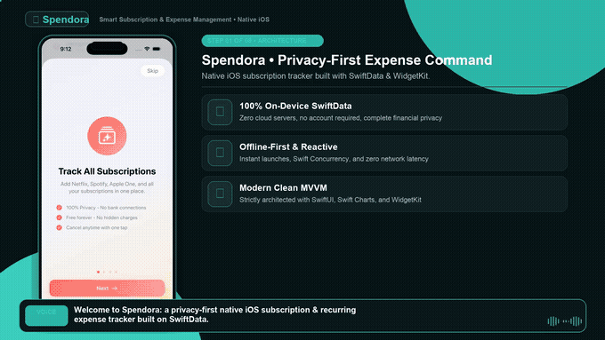
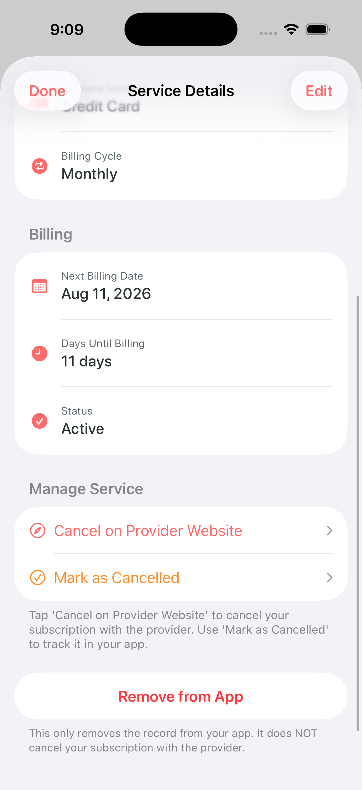
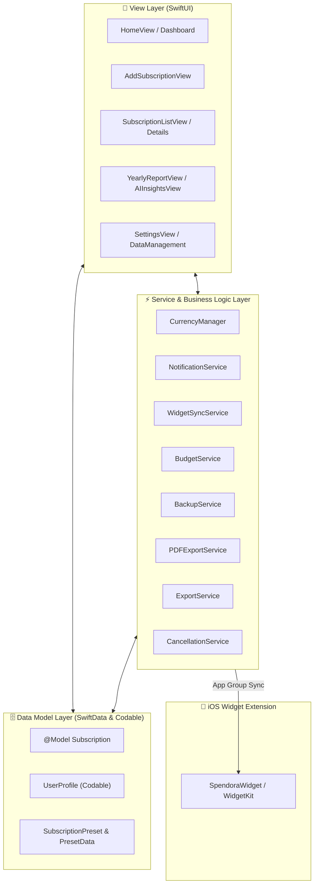

# 💎 Spendora — Smart Subscription & Expense Tracker
### Mobile Application Development Capstone Project 2026

<p align="center">
  
  
  
  
  
  
  
</p>

<p align="center">
  <b>A privacy-first native iOS application for tracking, analyzing, and managing recurring subscriptions and expenses.</b>
</p>

---

## 📌 Project Overview

**Spendora** is a native iOS application developed as a final **Mobile Application Development Capstone Project**. It helps users track recurring subscriptions, manage upcoming renewal dates, log bill payments with instant undo, and analyze spending patterns. 

Built with **SwiftUI**, **SwiftData**, **Swift Charts**, and **WidgetKit**, Spendora operates 100% offline on-device without requiring external servers or bank credentials.

---

## 🎥 App Demonstration

<p align="center">
  
</p>

<p align="center">
  <a href="https://raw.githubusercontent.com/snaimio/Spendora/main/demo/Spendora_Demo.mp4" target="_blank">
    
  </a>
</p>

> 🎬 **Walkthrough Video**: Complete demonstration with voice narration covering the Dashboard, 1-Tap Record Payment & Undo, Presets Catalog, AI Insights, Yearly Reports, Widgets, and Settings.

---

## 📱 App Screenshots

| Dashboard & Budget | Subscriptions Directory | Service Details & Cancel |
|:---:|:---:|:---:|
|  |  |  |

| Add Subscription | Yearly Financial Reports | Home Screen Widgets |
|:---:|:---:|:---:|
|  |  |  |

---

## ✨ Key Features

### 📊 Dashboard & Smart Tracking
* **Executive Spending Overview**: Live monthly run rate in San Francisco Rounded typography alongside a real-time budget utilization progress bar.
* **1-Tap Payment & Instant Undo**: Log payments directly from the dashboard to advance renewal dates (+1 month or +1 year) and reschedule reminders. Tap Undo anytime to roll back immediately.
* **Live "Due in X Days" Countdowns**: Dynamic countdown badges alerting you to upcoming renewal charges.

<br>

### ➕ Fast Creation & Management
* **Preset Catalog & Color Chips**: Quick-add presets for 15+ popular services (Netflix, Spotify, ChatGPT, Apple One) with custom theme colors and flexible billing cycles.
* **Search, Filters & Swipe Actions**: Search subscriptions, filter by active or cancelled status, sort by price or renewal date, swipe to log payments, and long-press for native iOS context menus.
* **Direct Web Cancellation**: 1-tap launcher opening the provider's official cancellation page directly in Safari.

<br>

### 💡 Financial Intelligence & Reports
* **AI Cost Optimization**: 1–5 star utility scoring engine that flags low-value subscriptions and calculates potential annual savings.
* **Yearly Trends & Statements**: Interactive Swift Charts comparing historical and projected spending, category breakdowns, and exportable PDF statements & CSV spreadsheets.
* **Gamified Savings Score**: Dynamic financial health score and milestone challenges rewarding you as you cut unnecessary expenses.

<br>

### 📱 Widgets, Privacy & Settings
* **Home & Lock Screen Widgets**: Small, Medium, Large, and Lock Screen accessories styled in Midnight Sage Teal (`#0E2426`) with live App Group synchronization.
* **100% Offline Privacy**: On-device persistence with SwiftData, multi-currency formatting (10+ currencies), custom reminder delivery times, and full JSON backup & restore.

---

## 🏗️ System Architecture & Data Flow



---

## 📊 Core Data Models & Schemas

Spendora uses type-safe Swift data models combining **SwiftData** `@Model` persistence and `Codable` profile preferences.

### 1. `Subscription` (`@Model` Entity)
The primary persistence schema managed via SwiftData:

```swift
@Model
final class Subscription {
    var id: UUID                         // Unique record identifier
    var name: String                     // Service name (Netflix, Spotify, etc.)
    var cost: Double                     // Billing cost per cycle
    var category: String                 // Category (Entertainment, Productivity, Utilities, etc.)
    var isYearly: Bool                   // Billing cycle flag (true = Yearly, false = Monthly)
    var nextBillingDate: Date            // Next scheduled charge date
    var previousBillingDate: Date?       // Previous billing date for instant payment undo
    var lastPaymentDate: Date?           // Timestamp when payment was last recorded
    var notes: String?                   // User notes & reminders
    var colorHex: String?                // Accent theme color hex string
    var isTrial: Bool                    // Free trial status flag
    var trialEndDate: Date?              // Free trial expiration date
    var usageRating: Int                 // Value satisfaction rating (1 to 5 stars)
    var paymentMethod: String            // Payment method (Credit, Apple Pay, PayPal, etc.)
    var iconName: String?                // SF Symbol icon identifier
    var isCancelled: Bool                // Active vs. Cancelled status
    var cancellationUrl: String?         // Direct provider web link for cancellation
}
```

### 2. `UserProfile` (`Codable` Model)
Manages user preferences stored locally via `UserDefaults`:

```swift
struct UserProfile: Codable {
    var id: UUID                         // Local profile identifier
    var name: String                     // User display name
    var email: String                    // Account email address
    var defaultCurrency: String          // Preferred currency symbol & code (USD, CAD, EUR, etc.)
    var monthlyBudget: Double            // User-configured monthly budget limit
    var notificationsEnabled: Bool       // Global notification toggle
    var reminderTime: Date               // Preferred morning reminder delivery time
}
```

---

## ⚡ Core Services & Managers

| Service | Responsibility |
|---|---|
| `CurrencyManager` | Formats currencies and resolves symbols across 10+ currencies (USD, CAD, EUR, GBP, JPY, AUD, etc.). |
| `NotificationService` | Schedules advance local reminders for upcoming renewal dates via `UNUserNotificationCenter`. |
| `WidgetSyncService` | Real-time synchronization of active subscriptions and spending to WidgetKit via App Groups (`group.com.trios2026sn.Spendora`). |
| `BudgetService` | Calculates budget compliance, spend progress, and alerts against user-defined spending caps. |
| `BackupService` | Generates secure JSON data exports and handles local document picker restoration. |
| `PDFExportService` | Generates vector-rendered PDF reports summarizing yearly and monthly spend breakdowns. |
| `ExportService` | Generates standard CSV spreadsheets for external financial analysis. |
| `CancellationService` | Resolves official web cancellation links and guidance for popular subscription providers. |

---

## 📂 Project Directory Structure

```
Spendora/
├── demo/                                     # Capstone Presentation Video & Media
│   ├── Spendora_Demo.mp4                     # Full Walkthrough Video with Voice Narration
│   └── thumbnail.png                         # Video presentation cover thumbnail
│
├── screenshots/                              # Live iOS Screen Previews
│   ├── demo_preview.gif                      # Animated interactive flow preview
│   ├── dashboard.png                         # Dashboard & Monthly Spend Hero
│   ├── dashboard_1.png                       # Next Charge Card with 1-Tap Payment
│   ├── subscriptions.png                     # Subscriptions list & sorting
│   ├── service_details.png                   # Provider details & cancellation link
│   ├── edit_subscriptions.png                # Subscription editor
│   ├── add_subscription.png                  # Preset catalog with color chips
│   ├── calendar.png                          # Interactive renewal calendar
│   ├── yearly_report.png                     # Swift Charts analytics & PDF export
│   ├── ai_insights_1.png                     # Rule-based AI financial insights
│   ├── savings_score.png                     # Financial health score card
│   ├── challenges.png                        # Gamified savings achievements
│   ├── settings.png                          # Settings, Currency & JSON Backup
│   └── widget.png                            # Midnight Sage Teal widgets
│
├── Spendora/
│   ├── App/
│   │   └── SpendoraApp.swift                 # App entry point initializing SwiftData ModelContainer
│   │
│   ├── Models/                               # SwiftData @Model & Data Structures
│   │   ├── Subscription.swift                # Main SwiftData schema & properties
│   │   ├── Subscription+Calculations.swift   # Financial calculation helper extensions
│   │   ├── Subscription+Formatting.swift     # Formatting & 1-tap payment undo helpers
│   │   ├── UserProfile.swift                 # User identity & preference settings
│   │   ├── SubscriptionPreset.swift          # Preset template structure
│   │   ├── SubscriptionPresetData.swift      # Catalog of popular subscription presets
│   │   ├── PaymentMethod.swift               # Payment method enum & SF Symbol mapping
│   │   └── SortOption.swift                  # Sorting modes for subscription lists
│   │
│   ├── Services/                             # Core Business Logic & Managers
│   │   ├── CurrencyManager.swift             # Currency conversion & formatting
│   │   ├── NotificationService.swift         # Local advance notification scheduler
│   │   ├── WidgetSyncService.swift           # WidgetKit App Group sync manager
│   │   ├── BudgetService.swift               # Monthly spending budget calculator
│   │   ├── BackupService.swift               # JSON export & restore engine
│   │   ├── PDFExportService.swift            # Native vector PDF builder
│   │   ├── ExportService.swift               # CSV spreadsheet generator
│   │   └── CancellationService.swift         # Provider cancellation URL builder
│   │
│   ├── Styles/                               # Apple Native HIG Design Tokens
│   │   └── SpendoraTheme.swift               # Sage Teal #2AB7A9 theme & Apple system surfaces
│   │
│   ├── Views/                                # SwiftUI Feature Screens
│   │   ├── Home/                             # Dashboard, Next Charge card, 1-Tap Record Payment
│   │   ├── Subscriptions/                    # List view, Search, Detail cards, Swipe actions
│   │   ├── Add/                              # Add Subscription form & preset picker
│   │   ├── Reports/                          # Swift Charts analytics, PDF export, AI Insights
│   │   ├── Calendar/                         # Renewal calendar
│   │   ├── Onboarding/                       # First-launch onboarding
│   │   ├── Profile/                          # Profile settings & authentication sheets
│   │   └── Settings/                         # App options, JSON Backup, About Capstone
│   │
│   └── Assets.xcassets                       # App logo, icons, accent colors
│
├── SpendoraWidget/                           # iOS 17 Home Screen Widget Extension
│   ├── SpendoraWidget.swift                  # Small, Medium, Large & Lock Screen widgets
│   └── SpendoraWidgetBundle.swift            # Widget bundle entry point
│
└── SpendoraTests/                            # Unit Test Suite
    ├── BudgetServiceTests.swift
    ├── CurrencyManagerTests.swift
    └── SubscriptionTests.swift
```

---

## 🚀 How to Run

### Prerequisites

| Requirement | Minimum Version |
|---|---|
| **Xcode** | 15.0+ (Xcode 16 recommended) |
| **iOS Target** | iOS 17.0 or later |
| **Swift Compiler** | Swift 5.9+ / Swift 6 |

### Build Instructions

1. **Clone the Repository**:
   ```bash
   git clone https://github.com/snaimio/Spendora.git
   cd Spendora
   ```

2. **Open in Xcode**:
   ```bash
   open Spendora/Spendora.xcodeproj
   ```

3. **Compile & Run**:
   * Select the `Spendora` scheme in Xcode.
   * Choose an iOS 17+ Simulator or connected iPhone device.
   * Press **`Cmd + R`** to build and run the application.

---

## 👨‍💻 Author & Academic Information

* **Developer**: Sheikh Naim
* **Course**: Mobile Application Development Capstone 2026
* **Repository**: [github.com/snaimio/Spendora](https://github.com/snaimio/Spendora)

---

## 📄 License

Distributed under the **MIT License**. See [LICENSE](LICENSE) for full details.
